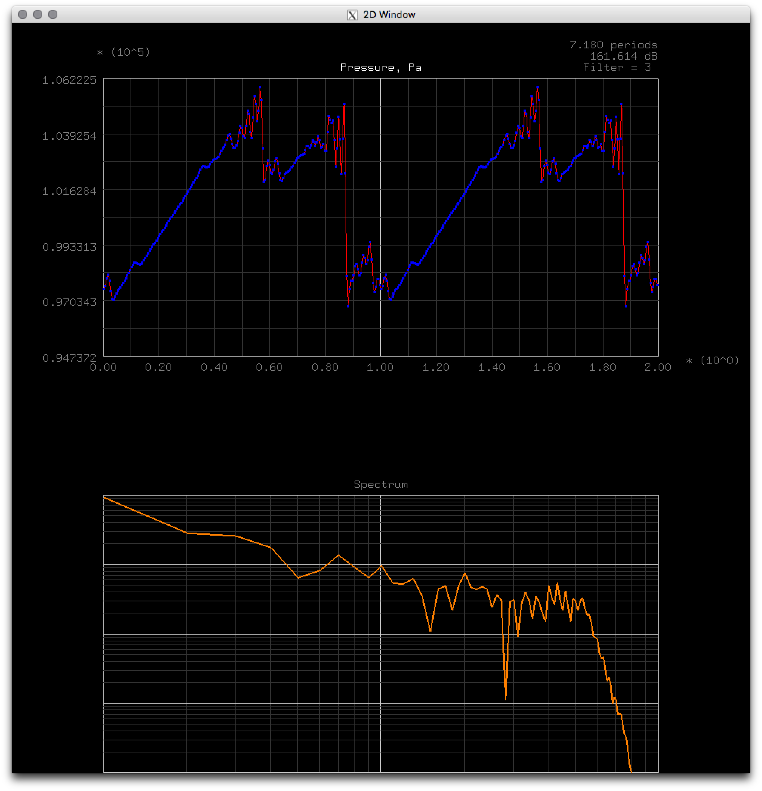

# Euler Equations 1D Compact

Models steepening of high-amplitude sound into shockwaves. Uses sixth-order [compact scheme](http://www.math.colostate.edu/~yzhou/course/math750_fall2009/Lele_1992JCP.pdf) with periodic tridiagonal solver to solve the Euler equation in 1D. Includes filtering via compact scheme but no flux limiting, so it tends to develop oscillations unless lots of filtering is used.

# LICENSE

&copy; 2016 Ricky Reusser. WTFPL.
